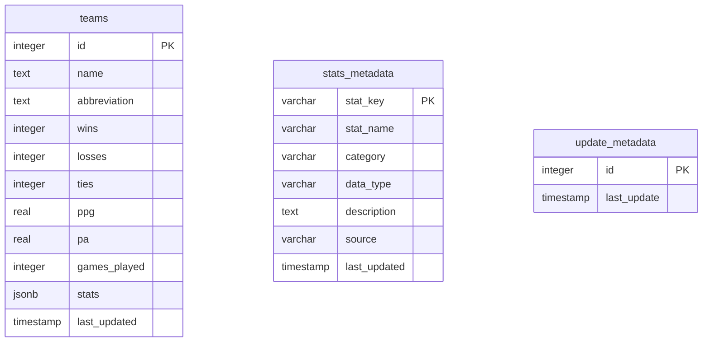

**HC Lombardo Database - ER Diagram**

**Tables:**
1. **teams** - Stores all 32 NFL teams with current season data
2. **stats_metadata** - Defines available statistics that can be tracked
3. **update_metadata** - Tracks when database was last updated
